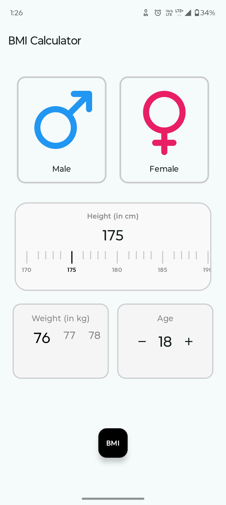
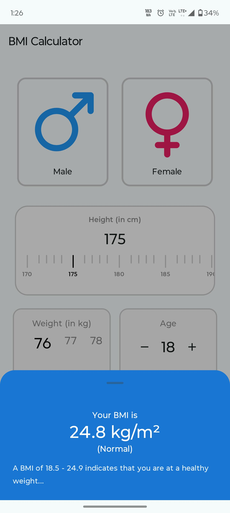

🏋️ BMI Calculator App
A simple and intuitive Body Mass Index (BMI) Calculator application built with Jetpack Compose. This app allows users to input their gender, height, weight, and age to calculate their BMI and provides a category for the result.

✨ Features
Gender Selection: Easily switch between Male and Female gender inputs.

Interactive Height Picker: A visually appealing and interactive height selector with haptic and sound feedback.

Dynamic Weight Selector: A smooth scrollable weight picker, also enhanced with haptic and sound feedback for a tactile experience.

Age Increment/Decrement: Simple buttons to adjust age.

BMI Calculation: Calculates BMI based on the entered metrics.

BMI Category: Provides a clear classification of the calculated BMI (Underweight, Normal, Overweight, Obese).

Modern UI: Built with Jetpack Compose for a modern, responsive, and engaging user interface.

Haptic Feedback: Provides subtle vibrations for a more engaging user experience on interactions like height/weight changes and age adjustments.

Sound Feedback: Includes custom "tick" sound effects for a richer interactive experience when adjusting height and weight.

---
## 📱 Screenshots

Here are some screenshots of the BMI Calculator in action:

_A clear view of the main BMI calculator interface, showing gender, height, weight, and age selection._

_The modal bottom sheet appearing at the bottom, displaying the calculated BMI and its category._

---

🛠️ Technologies Used
Kotlin - Primary programming language.

Jetpack Compose - Modern toolkit for building native Android UI.

AndroidX Libraries - Essential Android support libraries.

🚀 Getting Started
These instructions will get you a copy of the project up and running on your local machine for development and testing purposes.

Prerequisites
Android Studio 

Android SDK

Installation
Clone the repository:

Bash

git clone https://github.com/Sam-06060/BMI_Calculator.git
Open in Android Studio:
Open the cloned project in Android Studio.

Sync Gradle:
Let Gradle sync and download all necessary dependencies.

Run on an emulator or device:
Connect an Android device or start an Android emulator and run the application.

📁 Project Structure
composefirst/
├── app/
│   └── src/
│       └── main/
│           ├── java/
│           │   └── com/
│           │       └── example/
│           │           └── composefirst/
│           │               ├── MainActivity.kt
│           │               └── ... (other composables and supporting files)
│           └── res/
│               ├── drawable/
│               │   ├── mars.xml
│               │   └── venus.xml
│               ├── raw/
│               │   └── tick.wav
│               └── ... (other resources)
├── build.gradle.kts
└── ... (other gradle and project files)

🤝 Contributing
Contributions are what make the open-source community such an amazing place to learn, inspire, and create. Any contributions you make are greatly appreciated.

Fork the Project

Create your Feature Branch (git checkout -b feature/AmazingFeature)

Commit your Changes (git commit -m 'Add some AmazingFeature')

Push to the Branch (git push origin feature/AmazingFeature)

Open a Pull Request

📄 License
Distributed under the MIT License. See LICENSE for more information.

✉️ Contact
Samson Ganta - samson06060@gmail.com

Project Link: https://github.com/Sam-06060/BMI_Calculator

